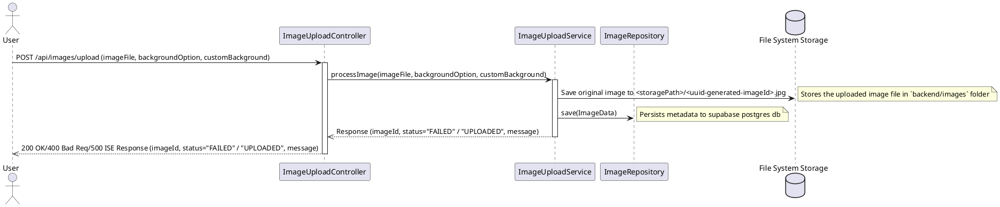

# **Service Architecture**

---

## **Table of Contents**

1. [Overview](#overview)
2. [Architecture](#architecture)
3. [Sequence Diagrams](#sequence-diagrams)
4. [Rough Directory Structure](#rough-directory-structure)

---

## **Overview**

This Project includes a **Next.js frontend** served by a **RESTful API** built using **Java Spring Boot**. It follows a **Layered Architecture** inspired by the **MVC (Model-View-Controller)** pattern, enhanced with additional layers for better separation of concerns and maintainability. This README demonstrates how to structure a Spring Boot application with **Model**, **Repository**, **Service**, and **Controller** layers.

---

## **Architecture**

### **1. Model Layer**

**Purpose**: Represents the application's data structures and business objects.

**Components**:
- **Entities/POJOs**: Define the data attributes and relationships.
- **Data Transfer Objects (DTOs)**: Facilitate data exchange between layers without exposing internal models.
- **Models**:
  - TBC

### **2. Repository Layer**

**Purpose**: Handles data persistence and retrieval, interacting directly with the database.

**Components**:
- **Repository Interfaces**: Extend Spring Data JPA interfaces to provide CRUD operations and custom queries.
    - TBC

### **3. Service Layer**

**Purpose**: Encapsulates business logic, acting as an intermediary between the Controller and Repository layers.

**Components**:
- **Service Classes**: Contain methods that define business operations, handle transactions, and coordinate complex processes.
  - `ImageUploadService`
  - `CropService`
  - `BackgroundRemovalService`
  - `ExportService`

### **4. Controller Layer**

**Purpose**: Manages HTTP requests, maps them to service methods, and returns responses to the client.

**Components**:
- **REST Controllers**: Annotated with `@RestController`, they define API endpoints and handle request/response lifecycle.
  - `ImageUploadController`
  - `CropController`
  - `BackgroundRemovalController`
  - `ExportController`

---
## **Sequence Diagrams**

### Image Upload Functionality:

---

## **Rough Directory Structure**

```plaintext
example-spring-service/
├── src/
│   ├── main/
│   │   ├── java/
│   │   │   └── com/
│   │   │       └── example/
│   │   │           ├── controller/
│   │   │           │   └── SomeController.java
│   │   │           ├── model/
│   │   │           │   └── SomeModel.java
│   │   │           ├── repository/
│   │   │           │   └── SomeRepository.java
│   │   │           └── service/
│   │   │               └── SomeService.java
│   │   └── resources/
│   │       ├── application.properties
│   │       └── static/
│   └── test/
│       └── java/
│           └── com/
│               └── example/
│                   └── UserControllerTest.java
├── .dockerignore
├── Dockerfile
├── pom.xml
└── README.md
```
